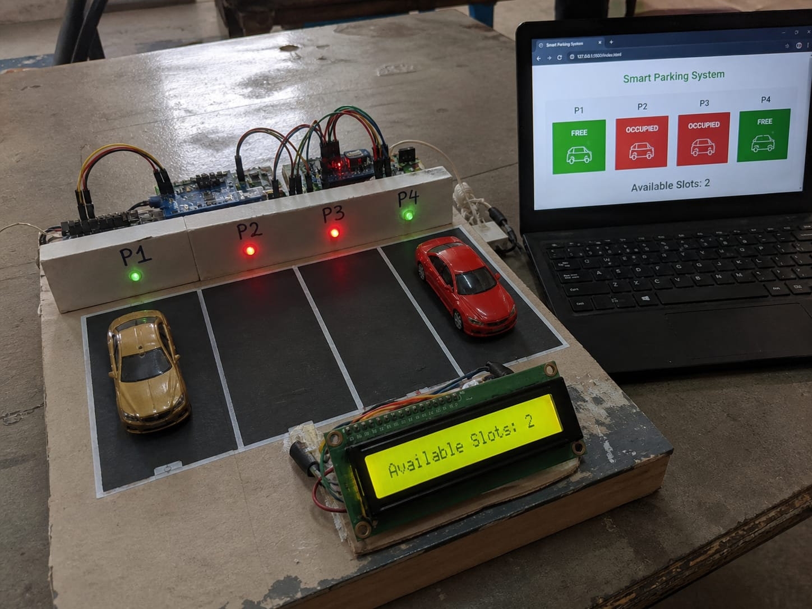
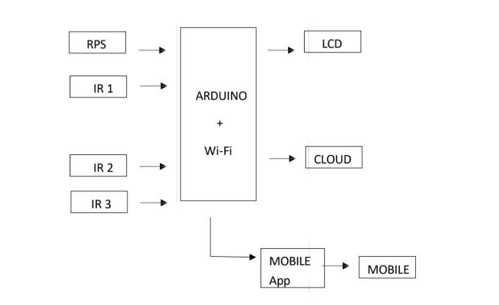

# Smart-Car-Parking-System
IoT-based smart parking system using Arduino and sensors

## ❗ Problem Statement
Finding available parking in crowded areas is time-consuming and inefficient. 
Drivers often waste fuel and time searching for empty slots, leading to traffic congestion and frustration.

This project aims to solve this problem by developing an IoT-based smart parking system that detects slot availability in real-time and displays it through a web application.

## 🎯 Objective
To design and implement a low-cost IoT-based system that monitors parking availability and provides real-time updates to users.

## 📌 Description
(This IOT-based Smart car parking management system used to detect empty slots for car parking which is more efficient and time saving than manual)

## ⚙️ Components Used
(NodeMCU, IR sensor, Power supply, LCD cloud for mobile application.)

## 🧩 System Flow
(IR Sensor → NodeMCU → WiFi → Cloud → Web App)

## 📷 Project Images

## 🧑‍💻 Code
The complete Arduino code for NodeMCU is available in this repository.

